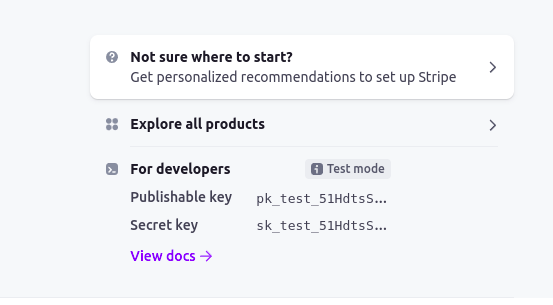

<b><h1 align="center" style="color: #cd9042" >Velzon</h1></b>
<p align="center">
    <a href="https://packagist.org/packages/cpriego/valet-linux">
        
    </a>
</p>

## About

Velzon is a Laravel [Amazon](https://amazon.com) clone project using the TALL stack ([Tailwindcss](https://tailwindcss.com/), [Alpinejs](https://github.com/alpinejs/alpine/), [Laravel](https://laravel.com/), [Livewire](https://laravel-livewire.com/) ).

> Note: Work in Progress.

## Screenshots


See the full home page [here](https://raw.githubusercontent.com/josuapsianturi/velzon/main/public/assets/images/screenshots/home-page-full.png)


See the full shop page [here](https://raw.githubusercontent.com/josuapsianturi/velzon/main/public/assets/images/screenshots/shop-page-full.png)


See the full checkout page [here](https://raw.githubusercontent.com/josuapsianturi/velzon/main/public/assets/images/screenshots/checkout-page-full.png)


See the full cart page [here](https://raw.githubusercontent.com/josuapsianturi/velzon/main/public/assets/images/screenshots/cart-page-full.png)


see the full admin all products page [here](https://raw.githubusercontent.com/josuapsianturi/velzon/main/public/assets/images/screenshots/admin-all-products-page-full.png)


## Additional Features
- Pagination
- Filter products by price and items
- Related products & Popular products
- Price filter Slider

    Admin actions (crud):
- Admin dashboard
- Categories
- All products
- Manage home slider
- Manage home categories
- Sale setting
- All coupons
- Orders

## Requirements
-   Node v14.19.1
-   npm 6.14.16
-   composer 2.2.6
-   php 8.0.17
-   mysql 8.0.27

## Tools
- [Notion](https://josuapsianturi.notion.site/99485e04f4e64d9eb6535c4a4e633d38?v=c6a0008ec2fe459d8f2ffd64b1869a47) 

## Installation
Here is how you can run the project locally:
1. Clone this repo
    ```sh
    git clone https://github.com/josuapsianturi/velzon.git
    ```
1. Go into the project root directory
    ```sh
    cd velzon
    ```
1. Install PHP dependencies 
    ```sh
    composer install
    ```
1. install front-end dependencies
    ```sh
    npm install && npm run dev
    ```
1. Copy .env.example file to .env 
    ```sh
    cp .env.example .env
    ```
1. Generate key 
    ```sh
    php artisan key:generate
    ```
1. Create account and get `STRIPE_SECRET` and `STRIPE_KEY` [ here](https://dashboard.stripe.com/test/dashboard). Make sure to copy `Secret key` and `Publishable key`.

> Note:
> - STRIPE_KEY=Publishable key
> - STRIPE_SECRET=Secret key

1. Create database velzon  (you can change `database_name`)
1. Go to `.env` file 
    - set database credentials (`DB_DATABASE=velzon`, `DB_USERNAME=root`, `DB_PASSWORD=`)
    - paste `STRIPE_KEY=(your Publishable key)` and `STRIPE_SECRET=(your Secret key)`
    > Make sure to follow your `DB_USERNAME` and `DB_PASSWORD`
1. Migrate
    ```sh
    php artisan migrate
    ```
1. Seed
    ```sh
    php artisan db:seed
    ```
    > This command will create Fake Categories(6) and Products(22)
1. Run server 
    ```sh
    php artisan serve
    ```  
1. Visit `localhost:8000` in your favorite browser.     

    > Make sure to follow your Laravel local Development Environment.

<h2 align="center"> ~_~ DO WHAT EXCITES ~_~</h2>

## Contributing
Pull requests are welcome.

## License
Velzon is an open-sourced software licensed under [the MIT license](https://github.com/josuapsianturi/velzon/blob/main/LICENSE)
